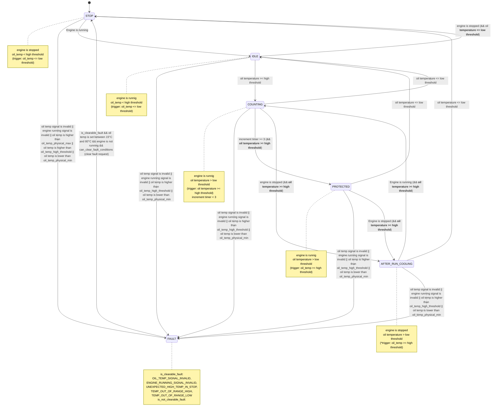
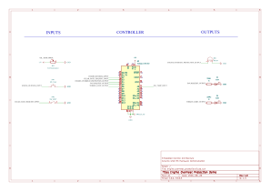

# Embedded Control Architecture

[](https://github.com/CY-M02605/Embedded-Control-Architecture/actions/workflows/mingw-tests.yml)

The GitHub Actions workflow automatically builds and runs the MinGW-based assert tests for the Engine Overheat Protection module on each push and pull request.

The GitHub Actions workflow automatically builds and runs the Engine Overheat Protection module assert test and utility unit tests, including hysteresis, increment_timer and lookup_table_1d, using MinGW on each push and pull request.

A vehicle-oriented C++ practice project for learning modular embedded control software architecture.

This project demonstrates how embedded control software can be organized into reusable control modules, typed signal interfaces, utility components, and a manager-based execution mechanism. The same control logic is first tested on a PC and then integrated into Arduino UNO hardware demos.

The current highlight is the **Engine Overheat Protection** demo. It uses a state-machine-based C++ module with signal validity handling, fault-state transitions, timer-based protection logic, and Arduino hardware inputs.

---

## Current Features

- Modular C++ control modules
- Typed signal objects with validity status
- Manager-based module registration and execution
- PC-based print tests and assert-based tests
- Arduino UNO hardware demos
- Hysteresis-based oil temperature warning
- State-machine-based engine overheat protection
- Fault reason handling and clear-fault request input
- Reusable utility components such as hysteresis, increment timer, and 1d-lookup table
- Separate PC and Arduino integration layers
- GitHub Actions workflow for MinGW based C++ testing

---

## Project Goals

The main goals of this project are:

- Practice modular C++ design for embedded control systems
- Understand the relationships between modules, signals, framework, utility, and application layers
- Build control modules with clear input and output signal interfaces
- Practice header/source separation
- Practice CMake-based PC builds and tests
- Port reusable control logic to Arduino UNO
- Connect software architecture with real hardware inputs and outputs
- Build a learning-oriented embedded software portfolio project

---


## Architecture Overview

The project is organized into several logical layers.

```text
Application Layer (framework: manager, module_interface)
    |
    v
Signals (signal)
    |
    v
Modules (engine_overheat_protection, etc)
    |
    v
Utility Components (hysteresis, increment_timer, etc)

Framework Manager runs registered modules periodically.
```

---

## Framework Layer

The `framework` layer provides the basic execution structure.

### ModuleInterface

`ModuleInterface` is the base interface for control modules. Each module implements a common `Update()` method so that different modules can be executed through the same mechanism.

### Manager

`Manager` stores registered modules and calls their `Update()` functions through `UpdateAll()`.

The PC version can use standard C++ containers such as `std::vector`.

The Arduino version uses a fixed-length array instead of `std::vector`, because Arduino UNO has limited memory and does not provide the same full C++ standard library environment as a PC.

---

## Signals Layer

The `signals` layer provides typed signal objects for passing data between the application layer and control modules.

A signal contains:

- a value
- a validity status

The validity status allows a module to distinguish between usable input data and unavailable or invalid input data.

For example, an oil-temperature signal could later come from:

- an Arduino analog input
- a real temperature sensor
- CAN communication
- PC simulation data

The control module does not need to know the original source of the signal. This keeps the module reusable.

---

## Modules Layer

The `modules` layer contains application-specific control logic.

Examples include:

- `engine_overheat_protection`
- `oil_temp_warning`
- `fan_cooling_control`
- `gear_display_facade`
- `hydraulic_oil_warning`
- `vehicle_speed_control`
- `instantiation_practice`

A typical module:

1. reads one or more input signals
2. processes control logic in `Update()`
3. writes one or more output signals

---

## Utility Layer

The `utility` layer contains reusable helper algorithms and timing components.

### Hysteresis

`Hysteresis` provides stable switching behavior using separate high and low thresholds.

```text
Temperature >= high_threshold -> output ON
Temperature <= low_threshold  -> output OFF
low_threshold < temperature < high_threshold -> keep previous output
```

This prevents rapid output switching when the input fluctuates near one threshold.

### IncrementTimer

`IncrementTimer` provides count-based timing logic for module state transitions.

In the Arduino application layer, periodic execution can also be controlled by `millis()` so that the main loop does not rely on long blocking `delay()` calls.

### LookupTable1D

`LookupTable1D` provides simple one-dimensional table lookup with interpolation. It is used to convert oil temperature into output requests such as torque limit percentage or fan request percentage.

---

## Arduino Demos

### Oil Temperature Warning Demo

Path:

```text
Arduino_project/OilTempWarningDemo/OilTempWarningDemo.ino
```

This demo uses a potentiometer to simulate oil temperature and a warning output to demonstrate hysteresis-based control.

### Engine Overheat Protection Demo

Path:

```text
Arduino_project/EngineOverheatProtection/EngineOverheatProtection.ino
```

This demo uses:

- potentiometer input for simulated oil temperature
- push button input for engine running state
- push button input for clear fault request
- serial monitor output for state, fault reason, torque limit, fan request, and protection status

See [EngineOverheatProtection Module Notes](docs/modules/engine_overheat_protection_Arduino.md)

---

## Arduino Data Flow

```text
Potentiometer / Buttons
    |
    v
Arduino analogRead() / digitalRead()
    |
    v
Signal objects with validity status
    |
    v
Manager::UpdateAll()
    |
    v
EngineOverheatProtection::Update()
    |
    v
Output signals
    |
    v
Serial Monitor / LEDs / PWM outputs
```

Example ADC-to-temperature conversion for a `-30 °C` to `130 °C` simulation range:

```cpp
float MapAnalogToOilTemp(int raw_value) {
    return -30.0f + static_cast<float>(raw_value) * 160.0f / 1023.0f;
}
```

This maps:

```text
ADC 0    -> -30 °C
ADC 512  -> approximately 50 °C
ADC 1023 -> 130 °C
```

---

## PC Tests

The `tests` folder contains PC-based test programs separated into unit tests and module tests.

### Tools

MinGW Makefiles + CMake + g++.exe + Git Bash for Linux on Windows or MSVC + CMake + cl.exe + powerShell for VS on Window.

### Purpose

- verify module logic
- check signal behavior
- test boundary conditions
- validate modules before using them on Arduino hardware

### Example Build Commands

From the project root:

```bash
MinGW Makefiles + Git Bash
cmake -S tests/module/engine_overheat_protection -B build/tests/module/engine_overheat_protection -G "MinGW Makefiles"
cmake --build build/tests/module/engine_overheat_protection --config Debug
```

```bash
MSVC + PowerShell
cmake -S tests/module/engine_overheat_protection -B build/tests/module/engine_overheat_protection/build -G "Visual Studio 17 2022" -A x64
cmake --build build/tests/module/engine_overheat_protection/build --config Debug
```

To run CTest (common):

```bash
ctest --test-dir build/tests/unit -C Debug --output-on-failure
```

Notes:

- `Debug` builds are intended for development and testing.
- `Release` builds are more optimized.
- Assertion-based tests should usually be run in Debug mode.

---

## GitHub Actions

This project includes GitHub Actions for automated MinGW-based C++ testing.

The workflow file is located at:

```text
.github/workflows/mingw-tests.yml
```

It is triggered automatically on each push and pull request.

The workflow currently runs on a Windows runner and performs the following steps:

- Checkout the repository
- Configure the module test with CMake
- Build and run the test
- Configure the utility unit test with CMake
- Build and run the unit tests with CTest

The automated tests currently cover:

- EngineOverheatProtectionArduino
- Hysteresis
- IncrementTimer
- LookupTable1d

The CI status is displayed at the top of README by the badge, it helps confirm core C++ logic still builds and passes after each update. 


## Project Structure

Structure:

``` text
Embedded-Control-Architecture/
├── assembly/
|   ├── instantiation.h
|   └── instantiation_practice.h
|
├── docs/
|   ├── images/
|   |   └── engine_overheat_protection_schematic.svg
|   ├── docs/
|   |   └── engine_overheat_protection_Arduino.md
|   ├── CIRCUIT_NOTES.md
|   ├── GIT_OPERATION_MANUAL.md
|   ├── LINUX_NOTES.md
|   ├── TROUBLESHOOTING.md
|   └── README_first_version.md
|
├── examples/
|   ├── oil_temp-fan and torque state.md
|   └── 
|
├── framework/
|   ├── manager.h
|   └── module_interface.h
|
├── modules/
|   ├── gear_display_facade/
|   |   ├── include/
|   |   |   ├── gear_display_facade.h
|   |   |   └── gear_types.h
|   |   └── src/
|   |       └── gear_display_facade.cc
|   ├── hydraulic_oil_warning/
|   |   ├── include/
|   |   |   └── hydraulic_oil_warning.h
|   |   └── src/
|   |       └── hydraulic_oil_warning.cc
|   ├── instantiation_practice/
|   |   └── include/
|   |       ├── instantiation_practice.h
|   |       └── speed_monitor.h
|   ├── cooling_fan_control/
|   |   ├── include/
|   |   |   ├── cooling_fan_control.h
|   |   |   └── coolingFanControl.h
|   |   └── src/
|   |       ├── cooling_fan_control.cc
|   |       └── coolingFanControl.cc
|   ├── vehicle_speed_speed/
|   |   ├── include/
|   |   |   ├── vehicle_speed_speed.h
|   |   |   └── vehicleSpeedControl.h
|   |   └── src/
|   |       ├── vehicle_speed_control.cc
|   |       └── vehicleSpeedControl.cc
|   ├── engine_overheat_protection/
|   |   ├── include/
|   |   |   └── engine_overheat_protection.h
|   |   └── src/
|   |       └── engine_overheat_protection.cc
|
├── signals/
|   └── signal.h
|
├── utility/
|   ├── hysteresis.h
|   └── increment_timer.h
|
├── .github/
|   └── workflows
|       └── mingw-tests.yml (for automated test online)
|
├── tests/
|   ├── module/
|   |   ├── gear_display_facade/
|   |   |   ├── CMakeLists.txt
|   |   |   └── print_based_tests.cpp
|   |   ├── hydraulic_oil_warning/
|   |   |   ├── CMakeLists.txt
|   |   |   └── print_based_tests.cpp
|   |   ├── instantiation_practice/
|   |   |   ├── CMakeLists.txt
|   |   |   └── print_based_tests.cpp
|   |   ├── cooling_fan_control/
|   |   |   ├── CMakeLists.txt
|   |   |   └── print_based_tests.cpp
|   |   └── vehicle_speed/
|   |   |   ├── CMakeLists.txt
|   |   |   └── print_based_tests.cpp
|   |   └── engine_overheat_protection/
|   |       ├── CMakeLists.txt
|   |       ├── assert_based_tests.cpp
|   |       └── print_based_tests.cpp
|   └── unit/
|       ├── CMakeLists.txt
|       ├── test_hysteresis.cpp
|       ├── test_increment_timer.cpp
|       └── test_lookup_table_1d.cpp
|
├── Arduino_project/
|   ├── OilTempWarningDemo/
|   |   ├── OilTempWarningDemo.ino
|   |   ├── Version Managerment/
|   |   |   ├── 1/
|   |   |   |   └── OilTempWarningDemo.ino
|   |   |   └── 2/
|   |   |       └── OilTempWarningDemo.ino
|   |   |
|   |   └── src/
|   |       ├── framework/
|   |       |   ├── manager.h
|   |       |   └── module_interface.h
|   |       ├── modules/
|   |       |   ├── fan_cooling_control.h
|   |       |   ├── fan_cooling_control.cpp
|   |       |   ├── oil_temp_warning.h
|   |       |   └── oil_temp_warning.cpp
|   |       ├── signals/
|   |       |   └── signal.h
|   |       └── utility/
|   |           ├── hysteresis.h
|   |           └── increment_timer.h
|   |
|   └── EngineOverheatProtection/
|       ├── EngineOverheatProtection.ino
|       ├── Version Managerment/
|       |
|       └── src/
|           ├── framework/
|           |   └── module_interface.h
|           ├── modules/
|           |   ├── engine_overheat_protection.h
|           |   └── engine_overheat_protection.cc
|           ├── signals/
|           |   └── signal.h
|           └── utility/
|               ├── lookup_table_1d.h
|               └── increment_timer.h
|
├── hardware/
|   └── engine_overheat_protection/
|       ├── engine_overheat_protection.kicad_pcb
|       ├── engine_overheat_protection.kicad_prl
|       ├── engine_overheat_protection.kicad_pro
|       └── engine_overheat_protection.kicad_sch
|
├── .gitignore
├── CMakeLists.txt
├── README.md
└── .vscode
    |── c_cpp_properties.json (`.vscode/c_cpp_properties.json` configures VS Code IntelliSense for this project, including include paths, compiler path, and C++ standard settings. It helps the editor resolve headers and provide code completion, but it is not the actual build configuration.)
    └── launch.json (`.vscode/launch.json` defines VS Code debug configurations. In this project, it is used to launch and debug the PC-based assert test executable, allowing breakpoints, step execution, and variable inspection for the engine overheat protection module.)
```

---

## Arduino Demo Highlight Description: 

### Engine Overheat Protection Arduino

The `EngineOverheatProtection` module monitors the engine-running state and hydraulic oil temperature. It activates overheat protection when the oil temperature remains above a configured high threshold for a configured duration.

This demo validates the same reusable C++ control logic in two environments:

1. **PC test environment**
   - Inputs are simulated by test code.
   - Outputs are checked by print-based or assert-based tests.

2. **Arduino UNO hardware environment**
   - Oil temperature is simulated by a potentiometer.
   - Engine-running status is simulated by a push button.
   - Fault clearing is simulated by another push button.
   - Current state, fault reason, and output requests are printed through the serial monitor.

#### Inputs

- Oil temperature signal
- Engine running signal
- Clear fault request signal

#### Outputs

- Overheat protection status
- Torque limit request
- Fan request
- Current state
- Fault reason

### Engine Overheat Protection State Machine

#### State Definitions

- `STOP`
  - Engine is stopped.
  - Oil temperature is expected to be within a normal stopped condition.
  - Unexpected high oil temperature in this state is treated as a fault in this demo.

- `IDLE`
  - Engine is running.
  - Oil temperature is below the high threshold.

- `COUNTING`
  - Engine is running.
  - Oil temperature is at or above the high threshold.
  - The increment timer is counting before entering protection.

- `PROTECTED`
  - Engine is running.
  - Overheat protection is active.

- `AFTER_RUN_COOLING`
  - Engine has stopped after high temperature was detected.
  - Cooling behavior continues until oil temperature falls below the low threshold.

- `FAULT`
  - A fault condition has been detected.
  - The original fault reason is preserved until the fault is cleared.

#### Fault Reasons

Example fault reasons include:

- `NONE` (no fault)
- `OIL_TEMP_SIGNAL_INVALID`
- `ENGINE_RUNNING_SIGNAL_INVALID`
- `TEMP_OUT_OF_RANGE_LOW`
- `TEMP_OUT_OF_RANGE_HIGH`
- `UNEXPECTED_HIGH_TEMP_IN_STOP`
- `TEMP_RISE_TOO_FAST` (not set yet)
- `LOOKUP_TABLE_ERROR` (not set yet)

#### Fault Priority

The module checks signal validity and fault conditions before using input values for normal state transitions.

Priority:

```text
In STOP state:
OIL_TEMP_SIGNAL_INVALID > ENGINE_RUNNING_SIGNAL_INVALID > TEMP_OUT_OF_RANGE_HIGH > UNEXPECTED_HIGH_TEMP_IN_STOP > TEMP_OUT_OF_RANGE_LOW

In other states:
OIL_TEMP_SIGNAL_INVALID > ENGINE_RUNNING_SIGNAL_INVALID > TEMP_OUT_OF_RANGE_HIGH > TEMP_OUT_OF_RANGE_LOW
```

* Once an input signal (oil temp, is engine running, etc) is invalid, its value should not be used to determine normal state transitions.

#### State Diagram



### Demonstrated Behaviors

- Normal stopped state when the engine is not running
- Idle state when the engine is running and oil temperature is normal
- Timer-based transition from high oil temperature to protected state
- After-run cooling behavior after the engine stops while oil temperature is still high
- Fault transition when input signals are invalid or temperature is outside the expected range
- Fault transition for unexpected high oil temperature in the stopped state
- Fault reason preservation while the module remains in the fault state
- Clear-fault-request based recovery for clearable faults when recovery conditions are met

### Hardware Schematic

The hardware schematic for the Engine Overheat Protection Demo was created using KiCad.



##### Hardware Inputs

```text
Potentiometer outer pin  -> Arduino 5V
Potentiometer middle pin -> Arduino A0
Potentiometer outer pin  -> Arduino GND

Engine running button:
Arduino D2 -> latching switch -> GND
Use INPUT_PULLUP in software.

Clear fault request button:
Arduino D3 -> momentary push button -> GND
Use INPUT_PULLUP in software.
```

With `INPUT_PULLUP`, the digital input logic is inverted:

```text
Button released -> HIGH -> false
Button pressed  -> LOW  -> true
```

##### Hardware Outputs

```text
Engine overheat protection output (while engine is running):
Arduino D4 -> buzzer -> GND
Use OUTPUT in software.

Fan request output:
Arduino D5 -> 220 ohm resistor -> LED (green) -> GND
Use OUTPUT (PWM) in software.

Torque limit output:
Arduino D6 -> 220 ohm resistor -> LED (blue) -> GND
Use OUTPUT (PWM) in software.

Fault output:
Arduino D7 -> 220 ohm resistor -> LED (red) -> GND
Use OUTPUT in software.
```

##### Demo Video

A short Arduino hardware demo video can be added here.

```md
[](docs/videos/engine_overheat_protection_demo.mp4)
```
---

## Troubleshooting Notes

Common issues encountered during Arduino integration:

- `std::vector` is not available in the Arduino UNO AVR environment.
- Use a fixed-size array instead of `std::vector` for the Arduino `Manager`.
- Use global `size_t` with `<stddef.h>` instead of relying on `std::size_t` in the Arduino AVR environment.
- Each header file should include the headers required by the types it directly uses.
- Do not confuse hardware pin constants with `Signal` objects.
- Use `.Set()` to update a `Signal`.
- Use `.GetValue()` when printing a `Signal`.
- Use `static_cast<int>()` or helper functions when printing `enum class` values.
- With `INPUT_PULLUP`, a pressed button reads `LOW`.
- If upload fails on Linux with `/dev/ttyACM0 Permission denied`, check serial port permissions and the `dialout` group.
- Potentiometer readings may need hardware or software filtering.

For more details:

- [Troubleshooting Notes](docs/TROUBLESHOOTING.md).
- [Circuit Notes](docs/CIRCUIT_NOTES.md).

---

## Current Status

Completed:

### Software Architecture
- Basic module interface
- Manager-based module registration and execution
- Shared typed signals
- Signal validity handling
- Reusable utility components, include hysteresis, increment timer and lookup table

### Control Logic
- Hysteresis-based oil temperature warning logic
- State-machine-based engine overheat protection logic
- Timer based transition to protected state
- Fault state and fault reason handling
- Clear fault request input

### Test
- PC manual tests
- PC assert-based tests
- Automated unit tests for reusable utility components
- Arduino-compatiable assert test for Engine Overheat Protection
- GitHub Actions workflow for automated MinGW C++ tests
- Improved CMake organization

### Hardware
- Arduino UNO application structure
- Analog-input temperature simulation using a potentiometer
- Latching switch input for engine running
- Push-button input for clear fault request
- Buzzer output for overheat protected warning while engine is running
- PWM LED outputs for fan request and torque limit demonstration
- LED output for fault state indication

### Documentation and Demo
- Drew an Arduino circuit schematic
- Added the circuit schematic to the README

---

## Future Improvements

Possible future improvements include:

### Software Architecture
- Separate platform-independent utilities from Arduino-specific application logic more clearly

### Control Logic

### Test
- Add Arduino compile checks to GitHub Actions

### Hardware
- Add input filtering for noisy analog signals
- Add an LCD temperature display
- Add CAN-style signal simulation
- Add real temperature sensor support

### Documentation and Demo
- Improve documentation for each module
- Add a short Arduino hardware demo video

---

## Notes

This is a learning-oriented embedded-control architecture project.

It is not intended to be a production-ready ECU framework.

The purpose is to practice:

- C++ class design
- object lifetime and references
- header/source separation
- module-based architecture
- signal-based communication
- manager-based execution
- utility reuse
- CMake build structure
- Arduino hardware integration
- KiCad circuit diagram drawing 
- embedded debugging
- accumulating embedded experience

---

## License

This project is currently intended for personal learning and practice.
